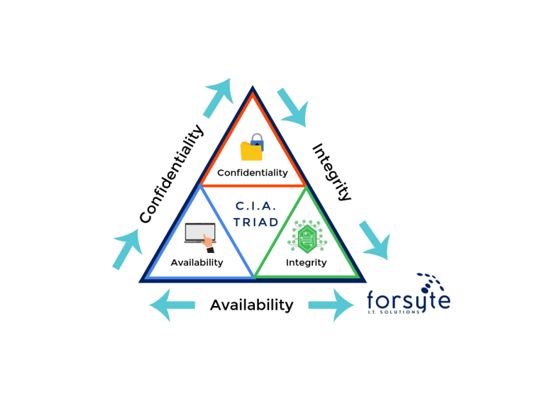
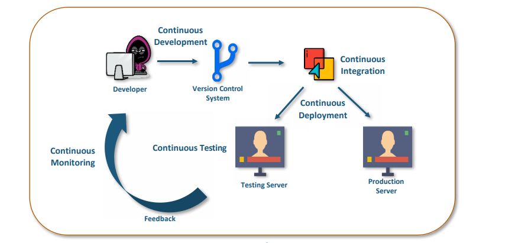

# Lecture Notes: Strategic Policy Development

Slide deck 1 from Sec+ instructor guide covers the below topics, if you choose to use it.

## Topic 2:

**Why**

- Why does information security exist?
  - **CIA Triad**
    - **Confidentiality**
    - **Integrity**
    - **Availability**
  - **Non-repudiation**
    - Simply means that someone cannot deny receiving a message or a transaction and the other party can't also not deny sending a message or a transaction
    - For example with cryptography it is enough to show that the message matches the digital signature with the sender's private key to prove that the sender sent the message and no one could have altered it in transit
    - Data integrity and authenticity need to be there to achieve non-repudiation

- Why do we need to know about compliance regulations and auditing?
  - Often a business driver towards improved cyber policy and posture
  - Cyber (formerly known as "infosec") has its roots in federal systems security, an economic sector laden with regulations
  - Standards such as those established by NIST provide useful frameworks for professionals to work in

    > If I asked you this morning to "get our company's systems secure enough to do business with the federal government," how would you proceed? What steps would you take? What if you had no framework to refer to?

**What**

- This week's module is centered around GRC. First, what is **GRC**?
  - GRC refers to a high level strategy for managing the organization's governance, risk management, and compliance with regulations. This is typically something your CSO and management team will oversee, while you operate the day to day systems at the entry level. Let's take a look next at how audits fit into the picture.
    - Governance
    - Risk
    - Compliance (sometimes "control" instead)

- What is **Information Assurance**?
  - Defined by NIST CSRC: Measures that protect and defend information and information systems by ensuring their availability, integrity, authentication, confidentiality, and non-repudiation. These measures include providing for restoration of information systems by incorporating protection, detection, and reaction capabilities.
  - Draw the **CIA Triad** (InfoSec Institute - CIA Triad)
    
  - Stands for
    - **Confidentiality**
      - ISC2 Definition: Preserving authorized restrictions on information access and disclosure, including means for protecting personal privacy and proprietary information.
      - One of the most important models designed to guide policies for information security within an organization
      - Means that only authorized users/systems can view sensitive or classified information
      - Data being over the network can't be accessed by unauthorized individuals
      - A good way to achieve confidentiality is to use encryption techniques to protect your data so that even if an attacker gets access to your data, they will still not be able to make sense of it
      - Using a VPN will also protect your data through the network
      - **Principle of least privilege**
        - Concept in which a user is given the minimum levels of access - or permissions - needed to perform his/her job functions
        - Considered a best practice and is fundamental in protecting access to high-value data and assets
      - Example of defensive control
    - **Integrity**
      - ISC2 Definition: Guarding against improper information modification or destruction and includes ensuring information non-repudiation and authenticity.
      - The idea here is make sure that the data has not been changed/modified
      - If your data gets corrupted, this is considered a failure to maintain integrity
      - Hash functions are a good way to check if data has been modified or not
        - Hash functions will run over the data and give you back a hash value back (H1) which is attached to the data
        - When the data is received, the same hash function is ran over the data which gives you back a hash value (H2)
        - If H1=H2, it means that the data's integrity has been maintained and the contents were not modified
        - Two common types of hash:
          - SHA (Secure Hash Algorithm)
          - MD5 (Message Direct 5)
      - Example of defensive control
      - Certificates
        - Issued by a trusted third party (Certificate Authority) which proves the sender's identity to the receiver and receiver's identity to the sender
        - The CA issues an encrypted digital certificate contains:
          - Name of certificate holder
          - Serial number which is unique to each certificate
          - Expiration dates
          - Copy of certificate holder's public key
          - Digital Signature of the certificate issuing authority
    - **Availability**
      - ISC2 Definition: Ensuring timely and reliable access to and use of information by authorized users.
      - This means that the network, systems and/or data should be available to its users
      - Some of the things we can do to ensure availability are:
        - Maintain hardware
        - Regular upgrades
        - Fail-over plans
        - Prevent bottlenecks
        - Cloud or on-site backups
      - Can users access the systems?
      - Example of defensive control
  - Some sources such as NIST extend the triad with two additional components:
    - What is Authentication?
      - Authentication is the process of validating an identity
      - Verifying that you are who you say you are, this is basically what happens when you provide a username and password and the system logs you in
    - What is Non-Repudiation?
      - Means one user/party cannot deny receiving a message or a transaction and the other user cannot deny having sent a message or transaction
      - Example, showing that a message has a digital signature signed with the sender's private key
  - Vocabulary/concepts/themes

- What are the core concepts of information security?
  - NIST Cybersecurity Framework
  - Information Security Roles and Responsibilities
    - **CISO**
      - High-level leading management in which they are responsible for maintaining the strategy, success, and security of an organization.
      - Major Responsibilities:
        - Security Operations
        - Disaster Recovery
        - Security Finance Management
        - Documentation
        - Compliance
        - Program Onboarding
    - **ISSO**
      - Person assigned responsibility for maintaining the appropriate operational security posture for an information system or program
  - **Information Security Business Units**
    - **SOC**
      - Goal is to defend against threats in a formalized, disciplined approach
      - Provide services to protect against cyber attacks: Monitoring, managing and hosting security tools
      - **SOC Jobs and Responsibilities**
        - Alert Analyst
          1. Monitoring Incident
          2. Opens Ticket
          3. Basic Threat Mitigation
        - Incident Responder
          1. Deep Investigation
          2. Advises Remediation
        - SME/Hunter
          1. In depth knowledge
          2. Threat Hunting
          3. Preventive measures
        - SOC Manager
          - Manages all the resources of the SOC and functions as the point of contact for the larger organization
      - **SOC Technologies**
        - Event collection, correlation, and analysis
        - Security Monitoring
        - Security Control
        - Log management
        - Vulnerability assessment
        - Vulnerability tracking
        - Threat intelligence
    - **DevOps**
      - A software development methodology that improves the collaboration between developers and operations teams using automation tools
      - **Goal** - increase an organization speed when it comes to delivering applications and services
      - SDLC lifecycle stages
        - Continuous Development
        - Continuous Integration
        - Continuous Deployment
        - Continuous Testing
        - Continuous Monitoring

        

    - **DevSecOps**
      - A software development management that brings in security to the DevOps equation
      - Creates an automated Continuous Delivery pipeline
      - **Goal**
        - automate, manage, and enforce security throughout the SDLC
        - Requires monitoring and applying security at each pipeline stage
      - Requires all teams and employees to take responsibility for security from the start and perform their tasks without compromising security

    - **CIRT**
      - Cyber Incident Response Team
      - Responsible for responding to security breaches, viruses and other catastrophic incidents

  - **Security Control Categories**
    - **Technical**
      - Involve hardware of software mechanisms used to manage access and provide protection
      - Security controls that are executed by technical systems
      - Include:
        - Logical access control systems
        - Security systems
        - Encryption
        - Data classification solutions
    - **Administrative**
      - Policies and procedures defined by an organization's security policy and compliance requirements
      - Includes:
        - Security policies
        - Employee background checks
        - Security awareness training
        - Formal change management procedures
    - **Physical**
      - Items you can physically touch
      - Form the outer line of defense against direct access to data
      - Includes:
        - Protecting backup media
        - Security output and mobile file storage devices
        - Facility design details (layout, doors, guards, locks, surveillance systems, etc.)

  - **Security Controls**
    - Classified by when they act relative to a security breach:
      - ***Preventive*** - intended to prevent an incident from occurring
        - Examples:
          - Separation of duties
          - Access control
          - Security policies and procedures
          - System Hardening
          - Security Guards
          - Security Awareness Training
          - Firewalls
          - AV
          - IPS
      - ***Detective*** - intended to identify and characterize an incident in progress (sounding the alarm)
        - Include:
          - Audit trails
          - IDS
          - Checksums
          - SIEM
          - Log Monitoring
          - Video Surveillance
          - Alarms
      - ***Corrective*** - intended to limit the extent of any damage cause by the incident
        - Are reactive and provide measures to reduce harmful effects or restore the system that is being affected
        - Examples:
          - IPS
          - Backups and System Recovery
          - OS upgrades
          - Vulnerability mitigation
          - AV

    - Classified according to their characteristics
      - ***Physical***
        - Fences, doors, locks, access-control vestibule (FKA: "mantraps"), and fire extinguishers
      - ***Deterrent***
        - reduce the likelihood of a deliberate attack
        - Discourage individual from violating information security policies or procedures
        - Usually take the form of a punishment or consequence
        - Examples:
          - Warnings indicating that systems are being monitored
          - Think of the "Beware of Dog" signs
      - ***Compensating***
        - Alternative method put in place to satisfy the requirement for a security measure that cannot be implemented
        - They come into play when a business or technology constraint exists and an effective alternate control is used in the current security threat landscape
      - ***Recovery*** - includes backups and restores, AV, server clustering, disaster recovery sites
      - ***Directive*** - deployed to direct, confine, or control the actions of subjects to ensure compliance with security policies

  

  Source: [Purplesec](https://purplesec.us/security-controls/)

**How**

- How do we improve a company by adding these controls and operations?
  - Try starting with the NIST CSF
  - Ref. [DEMO.md](DEMO.md)
