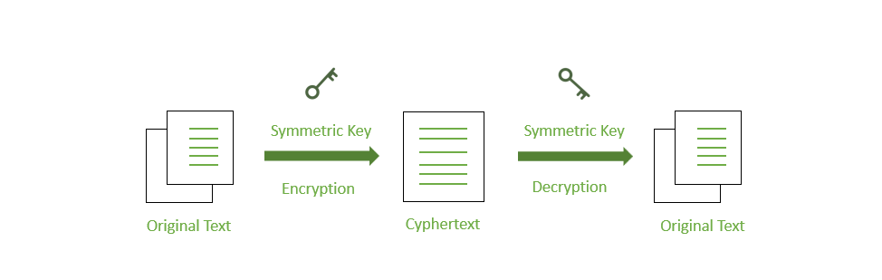

# Lecture Notes: Career Development Workshop 1

### Key Terms

- **Encryption**
  - **Encryption** is a method of preserving data confidentiality by transforming plaintext into ciphertext, which can only be decoded using a unique decryption key produced at the time of the encryption
  - Encryption uses a **cipher**, or mathematical algorithm, to transform readable plaintext into unreadable ciphertext.
  - **Types of Encryption**
    - Symmetric Encryption
      
    - Asymmetric Encryption
      
- **Decryption**
  - **Decryption** is the act of transforming ciphertext back to its original plaintext.
- **Hash value**
  - "**Hashing** is the simplest type of cryptographic operation. A cryptographic hashing algorithm produces a fixed length string from an input plaintext that can be of any length. The output can be referred to as a checksum, message digest, or hash. The function is designed so that it is impossible to recover the plaintext data from the digest (one-way) and so that different inputs are unlikely to produce the same output (a collision)." -[CompTIA, Topic 5A of Sec+ Instructor Guide](https://store.comptia.org/the-official-comptia-security-plus-instructor-guide/p/SEC-601-IPBK-20-C)
  - Data is converted to the hash using some hashing function, which can be any number generate from string or text.
  - Common hashing algorithms include:
    - **Secure Hash Algorithm (SHA)** is considered the strongest algorithm and appears in different variants, the most popular being SHA-256.
    - **Message Digest Algorithm #5 (MD5)** produces a 128-bit digest and is generally not considered as secure as SHA-256.
  - Note that a hash value cannot be decrypted. Rather, it can be "cracked" using such techniques as a rainbow table.

Pull up the Ops Challenge and step through it with students. Show them how to get started on each one.

- In Win 10 show how to encrypt a single file with 7-ZIP
- Encrypt a single file using a PowerShell script.

```powershell
# Encrypt a file
(Get-Item –Path "C:\Users\administrator\Desktop\filename").Encrypt()

# Decrypt a file
(Get-Item –Path "C:\Users\administrator\Desktop\filename").Decrypt()
```

- Demonstrate how to generate a "secure string" from a plaintext string. The result is an encrypted standard string that you can then save for later retrieval.

```powershell
# Generate an encrypted string from a plaintext string
"P@ssword1" | ConvertTo-SecureString -AsPlainText -Force | ConvertFrom-SecureString
```

- Generate the hash of a text string using PowerShell script.

```powershell
# Generate a hash without specifying the algorithm
Get-FileHash "C:\Users\administrator\Desktop\filename"

# Specify SHA256 algorithm explicitly
Get-FileHash "C:\Users\administrator\Desktop\filename" -Algorithm SHA256

# Specify MD5
Get-FileHash "C:\Users\administrator\Desktop\filename" -Algorithm MD5
```

- Demonstrate how hashes validate the integrity of file downloads.
- If time allows, discuss which hash algorithms are secure.
  - [Wikipedia](https://en.wikipedia.org/wiki/Secure_Hash_Algorithms) has a nice table comparing them.
